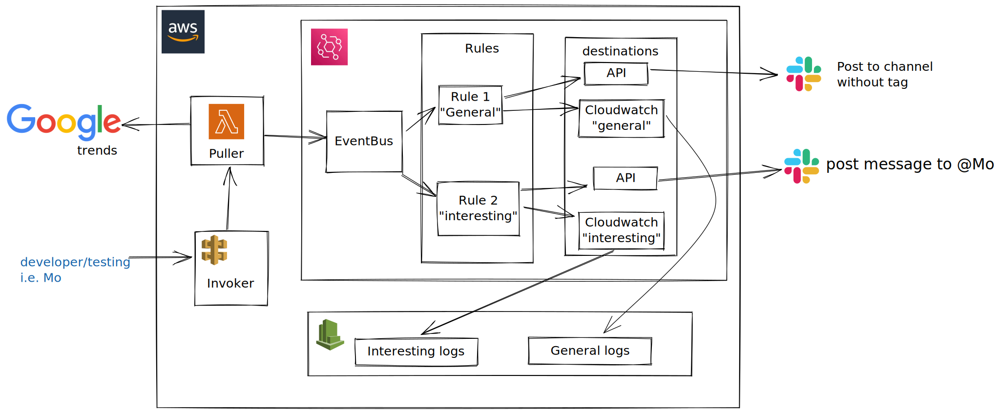

# EventBridge Sample

This is the code for the blog post: https://blog.makerx.com.au/empowering-event-driven-architecture/

## What is the user story for the demo?

As a busy developer and not having enough time to check the internet, I want to be notified of the Australian Google Search trends so that I'm aware of what's happening.

How to achieve this? setting up a small service to pull Google search trends i.e. "The Puller". It will pull the trends, do some transformation and push the events to the EventBridge service. The EventBridge service has rules to filter based on category  (based on some keywords to differentiate topics I'm interested in). The EventBridge service will post some events to a general channel and message others as a direct message to myself on Slack. The events will be delivered to Cloudwatch for tracing and logging with different logs groups.

## The Big Picture

